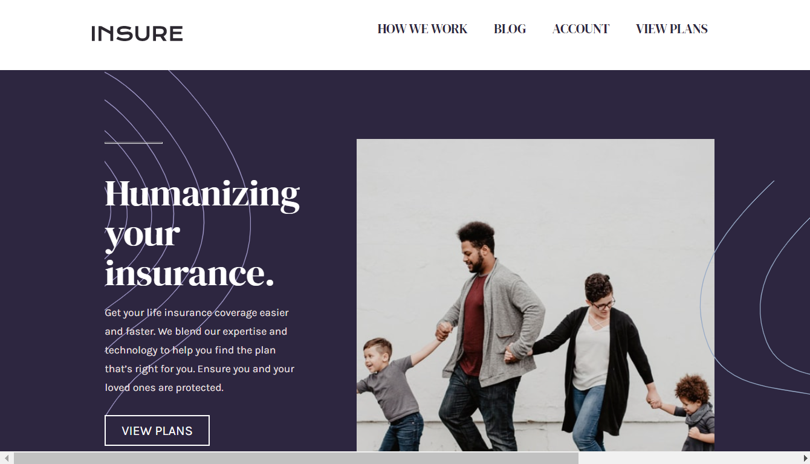

# Frontend Mentor - Insure landing page solution

This is a solution to the [Insure landing page challenge on Frontend Mentor](https://www.frontendmentor.io/challenges/insure-landing-page-uTU68JV8). Frontend Mentor challenges help you improve your coding skills by building realistic projects. 

## Table of contents

- [Overview](#overview)
  - [The challenge](#the-challenge)
  - [Screenshot](#screenshot)
  - [Links](#links)
- [My process](#my-process)
  - [Built with](#built-with)
  - [What I learned](#what-i-learned)
  - [Continued development](#continued-development)
- [Author](#author)

## Overview

### The challenge

Users should be able to:

- View the optimal layout for the site depending on their device's screen size
- See hover states for all interactive elements on the page
- See that the hamburger menu works on mobile devices

### Screenshot



### Links

- Solution URL: [Github Link](https://github.com/futuregit)
- Live Site URL: [InsureTommy Site](https://insuretommy.netlify.app/)

## My process

- 1. Again, I start with the html files. Creating the structure in desktop style only.
- 2. Then I add the font and colors in the css file.
- 3. Afterward, I start styling for mobile first from top to bottom.
- 4. Finally, I added the desktop styling using the media breakpoint

### Built with

- CSS (Basic is so good)
- HTML
- Flexbox 
- Mobile-first workflow
- VS Code (Best IDE I ever used)

### What I learned

How to create an drop down menu in mobile viewing. 
It seem complicated at first, but all you are really doing is
creating a backdrop that is positioned where you want it to be
the class is only in css which will later be dynamically added to the 
html file using JavaScript to select the element and toggle the class on and 
off by the hamburger icon event click.

To sum it up. The backdrop is turned on and off by a click.


```html
     <nav class="navbar">
        <ul class="navbar__links navbar__links--closed">
          <li><a href="#">How we work</a></li>
          <li><a href="#">Blog</a></li>
          <li><a href="#">Account</a></li>
          <li><a href="#">View plans</a></li>
        </ul>
```
```css
.navbar--open {
    position: absolute;
    top: 65px;
    left: 0;
    width: 100%;
    height: 200vh;    
    overflow-y: auto;
    background: var(--primary-darkviolet);
    display: flex;
    flex-flow: column;
    justify-content: space-between;
    background-image: url('./images/bg-pattern-mobile-nav.svg');
    background-repeat: no-repeat;
    background-size: 120%;
    background-position: 6% 35%;
    z-index: 2;
}
```
```js
const hamburgerIcon = document.querySelector('.hamburger__icon');
const navbar = document.querySelector('.navbar');
const navbarLinksClosed = document.querySelector('.navbar__links--closed');
const heroLeft = document.querySelector('.hero__left')

hamburgerIcon.addEventListener('click', () => {
  
    hamburgerIcon.classList.toggle('hamburger__icon--open');
    navbar.classList.toggle('navbar--open');
    navbarLinksClosed.classList.toggle('navbar__links--open');
    heroLeft.classList.toggle('emptyClass');
})
```

### Continued development

Still need more practice with creating hamburger icon with pull out menu.
You know what they say, "practice makes perfect".

## Author

- Website - [Tommy F.](https://tommywebman.netlify.app/)
- Frontend Mentor - [@futuregit](https://www.frontendmentor.io/profile/futuregit)
